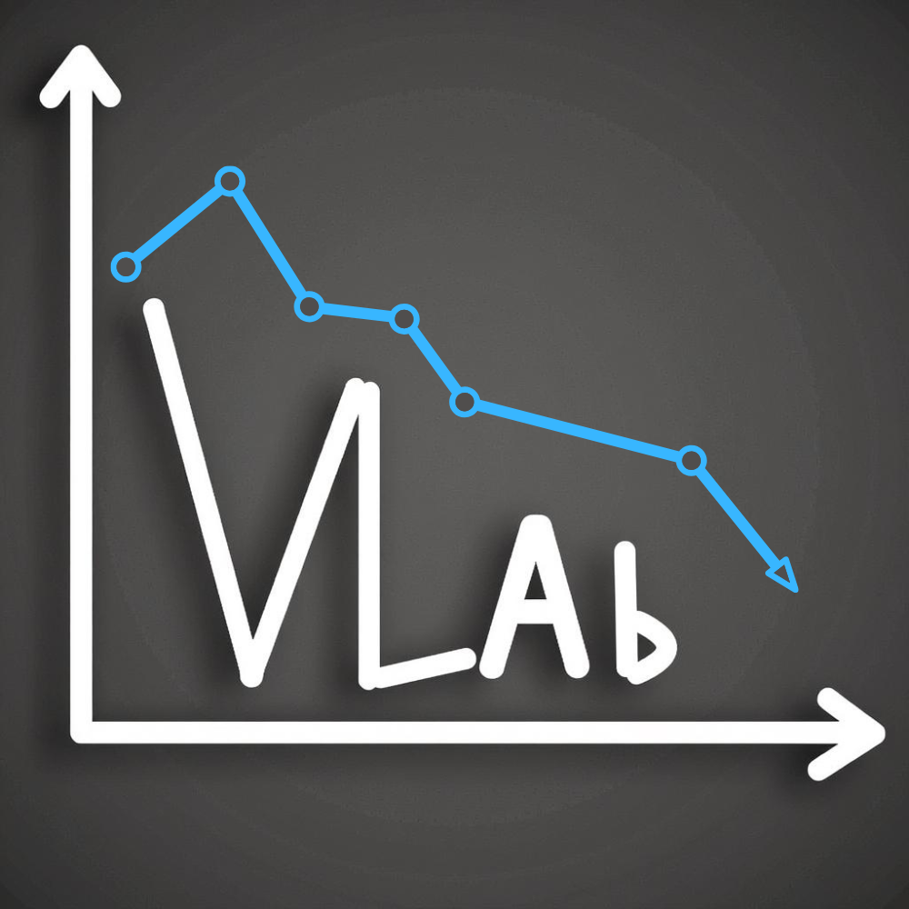

<div align="center">



# Your Laboratory for Pretraining VLAs 

A streamlined library for pretraining VLA models, derived from LeRobot, used to pretrain SmolVLA but focused specifically on pretraining workflows. This library enables efficient training of vision-language-action models for robotics applications.

</div>

## Table of Contents

- [Features](#features)
- [Prerequisites](#prerequisites)
- [Installation](#installation)
  - [Option 1: Conda Environment (Recommended)](#option-1-conda-environment-recommended)
- [Setup](#setup)
- [Usage](#usage)
  - [Basic Training](#basic-training)
  - [Multi-GPU Training](#multi-gpu-training)
  - [SLURM Cluster Training](#slurm-cluster-training)
- [Logging Options](#logging-options)
- [Configuration](#configuration)
- [Troubleshooting](#troubleshooting)
- [Additional Resources](#additional-resources)

## Features

It is directly compatible with the https://huggingface.co/datasets/HuggingFaceVLA/community_dataset_v1 and https://huggingface.co/datasets/HuggingFaceVLA/community_dataset_v2 that are used to pretrain smolvla. Note that, while this library can be efficient for pretraining, for finetuning we recommend using lerobot as it is more up-to-date with the inference pipeline and new hardware being added to lerobot. 

- 🚀 **Optimized for Pretraining**: Removed environment/evaluation dependencies for faster, cleaner pretraining
- 📊 **Dual Logging Support**: Choose between WandB or TrackIO for experiment tracking
- 🔧 **Multi-GPU Training**: Optimized for distributed training with Accelerate
- 🎯 **SmolVLA2 Focus**: Specialized for SmolVLA2 model architecture
- 🧹 **Clean Codebase**: Removed unused components for better maintainability

## Prerequisites

Before installing, ensure you have:

- **Python 3.10 or higher** (3.10+ recommended)
- **CUDA-capable GPU(s)** for training (recommended: CUDA 11.8 or 12.1+)
- **Conda** (for Option 1) or **pip** (for Option 2)
- **Git** (to clone the repository)

For detailed LeRobot installation instructions, see: [LeRobot Installation Guide](https://huggingface.co/docs/lerobot/en/installation)

## Installation

### Option 1: Conda Environment (Recommended)

The easiest way to set up the environment is using a conda environment similar to the lerobot environment.

#### Step 1: Check Your CUDA Version (Important!)

Before creating the environment, check your CUDA version:

```bash
# Check CUDA version
nvcc --version  # or nvidia-smi

# Note: Adjust PyTorch installation based on your CUDA version
```

#### Step 2: Create the Conda Environment from environment.yml

```bash
# Navigate to the project directory
cd /path/to/VLAb

# Create the environment from the provided file
conda env create -f environment.yml
conda activate lerobot

# If your system uses CUDA 12.1, edit environment.yml and set:
#   pytorch-cuda=12.1
```

#### Step 3: Set Up Python Path

```bash
# Set the PYTHONPATH to include the source directory
export PYTHONPATH="/path/to/VLAb/src:$PYTHONPATH"

# Add this to your ~/.bashrc or ~/.zshrc for persistence:
echo 'export PYTHONPATH="/path/to/VLAb/src:$PYTHONPATH"' >> ~/.bashrc
```

## Setup

### Verify Installation

Test that everything is set up correctly:

```bash
# Activate your environment
conda activate lerobot  # or source venv/bin/activate for venv

# Verify Python path
python -c "import sys; print('\n'.join(sys.path))" | grep VLAb || python -c "import sys; print('\n'.join(sys.path))"

# Test imports
python -c "from lerobot.configs.train import TrainPipelineConfig; print('✓ Configuration loaded')"
python -c "from lerobot.policies.factory import make_policy; print('✓ Policy factory loaded')"
python -c "from lerobot.datasets.factory import make_dataset; print('✓ Dataset factory loaded')"
```

### Configure HuggingFace Hub (if using remote datasets)

```bash
# Login to HuggingFace (if you need to download/upload models/datasets)
huggingface-cli login
```

## Usage

### Basic Training

Train a SmolVLA2 model on a single dataset:

```bash
# Activate environment
conda activate lerobot

# Train with WandB logging
python src/lerobot/scripts/train.py \
    --policy.type=smolvla2 \
    --dataset.repo_id="your-username/your-dataset" \
    --dataset.root="/path/to/local/datasets" \
    --output_dir="./outputs/training" \
    --batch_size=8 \
    --steps=50000 \
    --wandb.enable=true \
    --wandb.project="smolvla2-training"
```

### Train with Multiple Datasets

```bash
python src/lerobot/scripts/train.py \
    --policy.type=smolvla2 \
    --dataset.repo_id="dataset1,dataset2,dataset3" \
    --dataset.root="/path/to/local/datasets" \
    --output_dir="./outputs/multi_dataset_training" \
    --batch_size=8 \
    --steps=200000 \
    --wandb.enable=true \
    --wandb.project="smolvla2-multi-dataset"
```

### Multi-GPU Training

For multi-GPU training on a single machine, use Accelerate:

```bash
# First, configure accelerate
accelerate config

# Then launch training
accelerate launch src/lerobot/scripts/train.py \
    --policy.type=smolvla2 \
    --dataset.repo_id="your-dataset" \
    --dataset.root="/path/to/local/datasets" \
    --output_dir="./outputs/multi_gpu_training" \
    --batch_size=8 \
    --steps=200000 \
    --wandb.enable=true \
    --wandb.project="smolvla2-training"
```

### SLURM Cluster Training

For training on SLURM clusters, use the provided SLURM script:

```bash
# Edit the script to set your preferences
vim scripts/training/train_smolvla_optimized_fresh.slurm

# Update paths and parameters:
# - Change OUTPUT_DIR
# - Set REPO_IDS (comma-separated dataset list)
# - Configure GPU count (--gres=gpu:4)
# - Set logging backend (WandB or TrackIO)

# Submit the job
sbatch scripts/training/train_smolvla_optimized_fresh.slurm

# Monitor the job
squeue -u $USER
tail -f logs/smolvla_optimized_4gpu_fresh_*.out
```

## Logging Options

### WandB (Weights & Biases)

For cloud-based experiment tracking:

```bash
# Set up WandB (first time)
wandb login

# Training with WandB
python src/lerobot/scripts/train.py \
    --policy.type=smolvla2 \
    --dataset.repo_id="your-dataset" \
    --dataset.root="/path/to/local/datasets" \
    --output_dir="./outputs/training" \
    --wandb.enable=true \
    --wandb.project="your-project" \
    --wandb.entity="your-entity" \
    --wandb.notes="Training notes"
```

### TrackIO (Local-first)

For local experiment tracking:

```bash
# Training with TrackIO
python src/lerobot/scripts/train.py \
    --policy.type=smolvla2 \
    --dataset.repo_id="your-dataset" \
    --dataset.root="/path/to/local/datasets" \
    --output_dir="./outputs/training" \
    --trackio.enable=true \
    --trackio.project="your-project" \
    --trackio.notes="Training notes"

# View results locally
trackio show
```

### Local Only (No Logging)

```bash
python src/lerobot/scripts/train.py \
    --policy.type=smolvla2 \
    --dataset.repo_id="your-dataset" \
    --dataset.root="/path/to/local/datasets" \
    --output_dir="./outputs/training" \
    --wandb.enable=false \
    --trackio.enable=false
```

## Configuration

### Model Configuration

Key model parameters:

- **Policy Type**: `smolvla2`
- **VLM Model**: `HuggingFaceTB/SmolVLM2-500M-Video-Instruct` (default)
- **PEFT Method**: LoRA with configurable rank
- **Attention**: Cross-attention with causal masking

### Training Configuration

Common training parameters:

```bash
--batch_size=8                    # Batch size per GPU
--steps=200000                    # Total training steps
--policy.optimizer_lr=5e-4       # Learning rate for policy
--policy.optimizer_lr_vlm=1e-4   # Learning rate for VLM
--policy.scheduler_warmup_steps=1000
--policy.peft_config.r=32         # LoRA rank
--policy.use_amp=false            # Enable/disable mixed precision
```

### Dataset Configuration

Dataset-related parameters:

```bash
--dataset.max_num_images=2        # Maximum number of images per sample
--dataset.max_image_dim=256      # Maximum image dimension
--dataset.video_backend=pyav      # Video processing backend
--dataset.min_fps=30             # Minimum FPS filter
--dataset.max_fps=30             # Maximum FPS filter
```

### Resume Training

To resume from a checkpoint:

```bash
python src/lerobot/scripts/train.py \
    --config_path="./outputs/previous_training/train_config.json" \
    --resume=true \
    --output_dir="./outputs/previous_training"
```

## Troubleshooting

### Common Issues

**Issue**: `ModuleNotFoundError: No module named 'lerobot'`

**Solution**: Ensure PYTHONPATH is set correctly:
```bash
export PYTHONPATH="/path/to/VLAb/src:$PYTHONPATH"
```

**Issue**: CUDA out of memory

**Solution**: Reduce batch size or enable gradient accumulation:
```bash
--batch_size=4  # Reduce from default 8
--gradient_accumulation_steps=2  # Accumulate gradients
```

**Issue**: Import errors with PyAV/AV

**Solution**: Reinstall PyAV:
```bash
conda activate lerobot
pip uninstall av
pip install av>=14.2.0
```

**Issue**: WandB/TrackIO not working

**Solution**: Verify installation and authentication:
```bash
# For WandB
wandb login

# For TrackIO
pip install trackio
trackio --version
```

### Getting Help

- Check the logs in `logs/` directory for detailed error messages
- Verify your conda environment is activated: `conda info --envs`
- Ensure all dependencies are installed: `conda list` or `pip list`
- Check CUDA availability: `python -c "import torch; print(torch.cuda.is_available())"`

## Additional Resources

- **LeRobot Installation Guide**: https://huggingface.co/docs/lerobot/en/installation
- **LeRobot Documentation**: https://huggingface.co/docs/lerobot
- **HuggingFace Hub**: https://huggingface.co/
- **Accelerate Documentation**: https://huggingface.co/docs/accelerate

## Citation

If you use this library or models trained with it in your research, please cite the SmolVLA paper:

Shukor, M., Aubakirova, D., Capuano, F., Kooijmans, P., Palma, S., Zouitine, A., Aractingi, M., Pascal, C., Russi, M., Marafioti, A., Alibert, S., Cord, M., Wolf, T., Cadene, R. (2025). SmolVLA: A vision-language-action model for affordable and efficient robotics. Available at: https://arxiv.org/pdf/2506.01844

```bibtex
@article{shukor2025smolvla,
  title   = {SmolVLA: A vision-language-action model for affordable and efficient robotics},
  author  = {Shukor, Mustafa and Aubakirova, Dana and Capuano, Francesco and Kooijmans, Pepijn and Palma, Steven and Zouitine, Adil and Aractingi, Michel and Pascal, Caroline and Russi, Martino and Marafioti, Andres and Alibert, Simon and Cord, Matthieu and Wolf, Thomas and Cadene, Remi},
  year    = {2025},
  journal = {arXiv preprint},
  eprint  = {2506.01844},
  archivePrefix = {arXiv},
  primaryClass  = {cs.RO}
}
```

## File Structure

```
VLAb/
├── src/lerobot/                  # Source code
│   ├── configs/                  # Configuration classes
│   ├── datasets/                 # Dataset handling
│   ├── optim/                    # Optimizers and schedulers
│   ├── policies/                 # Policy implementations
│   │   └── smolvla2/            # SmolVLA2 specific code
│   ├── scripts/                  # Training scripts
│   └── utils/                    # Utility functions
├── scripts/training/             # SLURM training scripts
├── examples/                     # Example scripts
├── .gitignore                    # Git ignore file
└── README.md                     # This file
```

## License

Apache 2.0 License (inherited from LeRobot)
